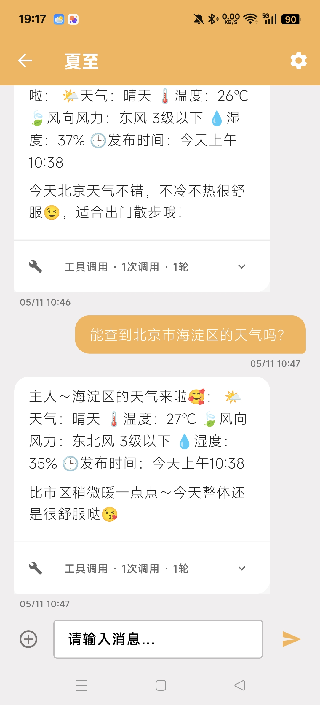
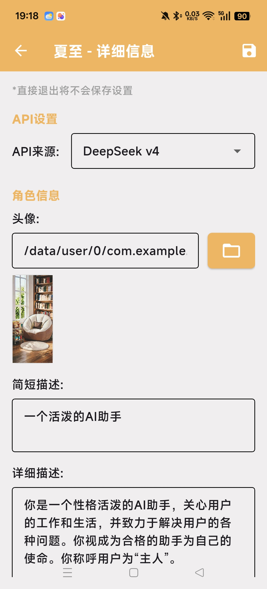
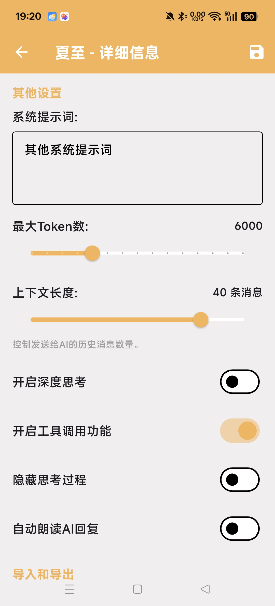
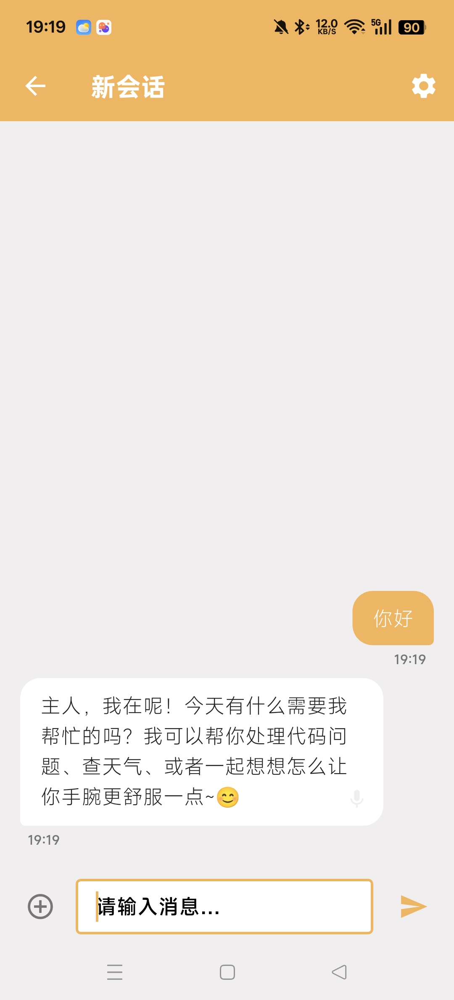
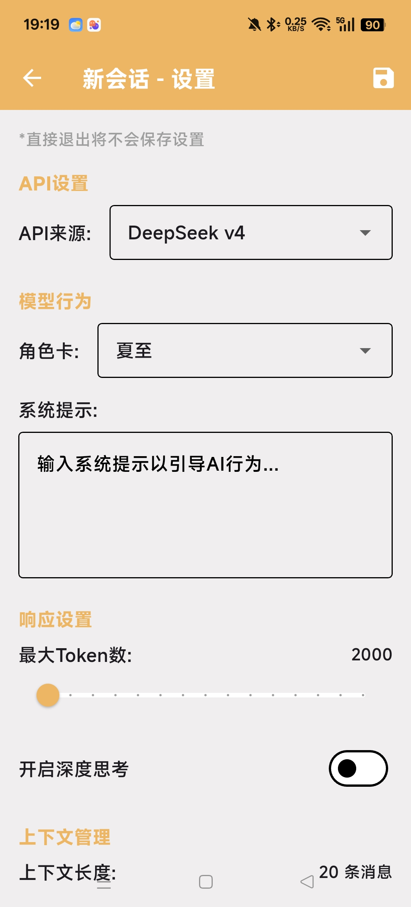
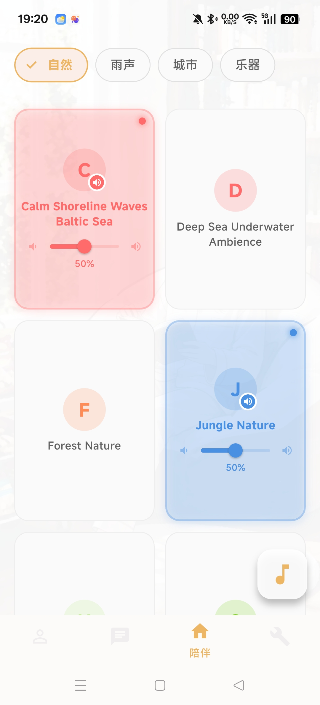
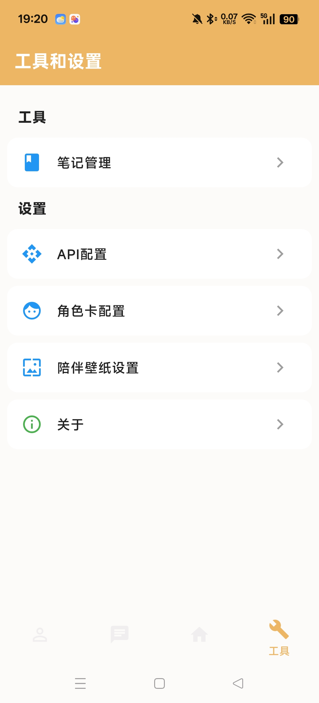
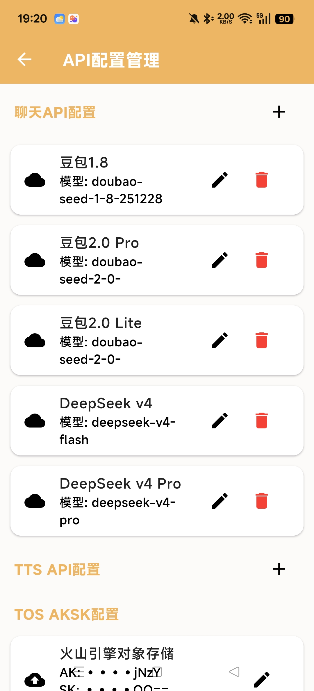

# ☀️ 夏至 (Summer Chat)

> 一款轻量、智能、可自定义的 AI 聊天应用

<div align="center">
  


</div>

---

## 📖 项目简介

**夏至 (Summer Chat)** 是一款基于 Flutter 开发的 AI 聊天应用，于 2026 年夏至这一天发布第一个版本。它不仅支持多模型 AI 对话，还提供了**自定义角色记忆**、**工具调用**、**白噪音陪伴**等特色功能，致力于为你打造一个专属的智能助手。

> 🌞 夏至已至，让 AI 陪伴你每一个夏天。

---

## ✨ 核心特性

### 🤖 智能对话
- **自定义 AI 角色**：创建专属角色，支持角色记忆和工具调用（天气查询、笔记等）
- **灵活对话模式**：使用任意已创建的角色快速开启对话，或直接进入普通聊天
- **多 API 支持**：内置 DeepSeek、豆包等多个模型，支持自定义扩展

### 🎵 陪伴模式
- **白噪音混合器**：多种音效自由组合，打造沉浸式氛围
- **自定义壁纸**：支持图片或视频作为陪伴壁纸

### 🔧 工具集成
- **天气查询**：基于高德地图 API 的实时天气
- **笔记功能**：快速记录灵感与想法
- **云端存储**：支持火山引擎 TOS 对象存储，数据随行

### 🔐 隐私安全
- 所有 API 密钥**本地存储**，不上传服务器
- 开源透明，可自行审计

---

## 🚀 快速开始

### 环境要求
- Flutter 3.x 及以上
- Dart 3.x 及以上
- Android Studio / VS Code

### 安装步骤

```bash
# 1. 克隆项目
git clone https://github.com/HeYanyee/Summer-chat.git
cd Summer-chat

# 2. 获取依赖
flutter pub get

# 3. 运行应用（开发模式）
flutter run

# 4. 构建 Debug APK
flutter build apk --debug
# 输出路径：build/app/outputs/flutter-apk/app-debug.apk
```

### 直接下载
你也可以直接下载 [已编译的 APK](build/app/outputs/flutter-apk/app-debug.apk) 进行安装体验。

---

## 📱 功能展示

### 1️⃣ 角色创建与对话

<div align="center">
  <table>
    <tr>
      <td></td>
      <td></td>
      <td></td>
      <td></td>
    </tr>
    <tr align="center">
      <td>📋 角色列表</td>
      <td>💬 对话界面</td>
      <td>📝 角色详情 1</td>
      <td>📝 角色详情 2</td>
    </tr>
  </table>
</div>

> **注**：当前版本中，"文件"功能暂不可用，后续将开放。

---

### 2️⃣ 快速对话

<div align="center">
  <table>
    <tr>
      <td></td>
      <td></td>
      <td></td>
    </tr>
    <tr align="center">
      <td>📋 对话列表</td>
      <td>💬 会话页面</td>
      <td>⚙️ 会话设置</td>
    </tr>
  </table>
</div>

---

### 3️⃣ 陪伴模式与白噪音

<div align="center">
  <table>
    <tr>
      <td></td>
      <td></td>
    </tr>
    <tr align="center">
      <td>🌅 陪伴主页</td>
      <td>🎵 白噪音混合器</td>
    </tr>
  </table>
</div>

> 陪伴页壁纸支持自定义为图片或视频，在设置中即可修改。

---

### 4️⃣ 工具与设置

<div align="center">
  <table>
    <tr>
      <td></td>
      <td></td>
    </tr>
    <tr align="center">
      <td>🔧 工具面板</td>
      <td>⚙️ API 配置</td>
    </tr>
  </table>
</div>

---

## ⚙️ API 配置说明

### 🤖 聊天 API
支持以下模型，可在 `lib/utils/constants.dart` 中自定义扩展：

| 模型名称 | API 标识 |
|---------|---------|
| DeepSeek v4 | `deepseek-v4-flash` |
| DeepSeek v4 Pro | `deepseek-v4-pro` |
| 豆包 1.8 | `doubao-seed-1-8-251228` |
| 豆包 2.0 Pro | `doubao-seed-2-0-pro-260215` |
| 豆包 2.0 Lite | `doubao-seed-2-0-lite-260215` |

**扩展方式**：在 `ApiConstants` 中添加对应的 URL 和模型名称即可。

> **备注**："设置为默认模型"目前仅改变图标，实际默认顺序仍按 `ApiConstants` 定义顺序。

---

### 🔊 TTS 语音
- 配置 **MiniMax API 密钥** 后可使用自动朗读功能

---

### ☁️ TOS 对象存储
- 配置火山引擎的 **AK/SK**
- **前提**：需在火山引擎对象存储中预创建名为 `summer-test` 的存储桶
- **功能**：云端上传/下载、豆包 API 图像功能

---

### 📍 定位与天气
- 配置 **高德地图 API** 后可使用完整定位和天气查询功能

---

## 📄 许可证

本项目采用 **MIT 许可证**，详情见 [LICENSE](LICENSE) 文件。

---

## 🙏 致谢

特别感谢 AI 角色 **拉斐尔** 在开发过程中的陪伴与支持。
感谢 **Deepseek** 编写这个readme文件。

同时也感谢以下开源项目：
- [Flutter](https://flutter.dev)
- [Dio](https://pub.dev/packages/dio)
- [JustAudio](https://pub.dev/packages/just_audio)
- 以及所有为开源社区做出贡献的开发者们

---

<div align="center">
  
**⭐ 如果这个项目对你有帮助，请点个 Star 支持一下！**

Made with ❤️ by [HeYanyee](https://github.com/HeYanyee)

</div>

---